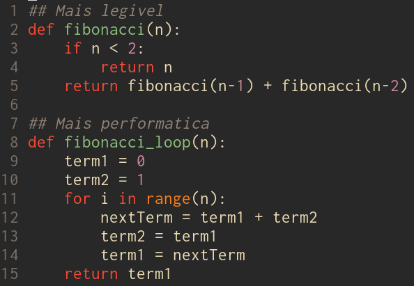

Clean code é um dos livros que está sempre em alta no mundo da programação. As vezes amado, as vezes odiado mas sempre relevante. E quase tanto quanto é relevante ele é mal entendido.

Muitos vêem o livro como um guia, um conjunto de regras (heurísticas, como dito no livro) para serem memorizadas e seguidas, ou pelo menos usadas como referência. E a estrutura do livro muitas vezes incentiva essa interpretação, que, na minha percepção, limita a utilidade do livro.

Algumas das críticas mais comuns ao livro são reflexo dessa interpretação, coisas como 'eu preciso de argumentos booleanos na minha função' ou 'O livro não tem uma opinião sobre funções lambda' são críticas comuns de pessoas que leem esse livro buscando um manual de refatoração pra carregar debaixo do braço a cada code review.

O verdadeiro poder do livro não está em te ensinar truques para diminuir uma função, ou regras pra seguir. O poder do livro é fazer você se importar com o código.

O conjunto de heurísticas do livro não deve ser encarado como um mandamento divino, mas sim como exercícios onde o objetivo é se habituar a tomar cuidado com a qualidade e legibilidade do código.

Quando olhamos por esse ângulo, as críticas às recomendações do livro perdem o sentido. Você não deve levar essas recomendações como um conjunto de regras a ser seguido. Se argumentos booleanos se adequam ao seu estilo de código, mantenha eles. O ponto não é sobre as regras, o ponto é o bom código.

Da mesma forma, não se pode esperar que o livro cubra todos os casos pra você, o livro ser genérico não é um bug, é uma feature. Isso é o que faz um livro com todos os exemplos em Java ser tão útil mesmo pra programadores que se recusam a chegar perto desta linguagem ou até de orientação à objeto no geral.

Uma crítica que se distingue das outras é a crítica à performance das ideias apresentadas no livro (como em [ "Clean" Code, Horrible Performance](https://www.youtube.com/watch?v=tD5NrevFtbU)). Performance e legibilidade muitas vezes são um trade-off, e não dá pra refatorar código sem pensar nos dois.

O livro acaba fugindo de uma gama interessante de problemas e decisões a serem tomadas. Quando legibilidade é mais importante que performance? Quando não é? Como manter algum nível de legibilidade quando performance é prioridade? O livro não só deixa essas questões em aberto, ele as ignora completamente, e isso é definitivamente um dos pontos mais fracos da obra.

Nesse ponto, já está claro que eu não acredito que clean code deve ser lido como um livro de referência e muito menos como um texto sagrado para se memorizar e viver por. Mas como você deveria ler clean code? 

Clean code deve ser lido como uma história, em sequência capítulo por capítulo, prestando atenção nos exemplos e acompanhando como aquele código completamente confuso e ilegível lentamente se torna óbvio e elegante

Está tudo bem levar algumas recomendações pra forma que você programa, mas com o tempo é importante que você aprenda, adote, modifique e crie novas regras que se adequem as especificações de como você programa.

Para isso é necessário um conhecimento considerável do contexto do seu programa. Esse código é para um servidor ou um cliente? Em que tipo de máquina o código será executado? Como a linguagem que você está utilizando funciona e quais são os possíveis benefícios e trade-offs entre legibilidade e performance no seu projeto?

E não se esqueça, as regras estão aqui pra facilitar o seu trabalho e o da sua equipe, se as regras entram no caminho de escrever código performático e limpo é hora de quebrar as regras.
